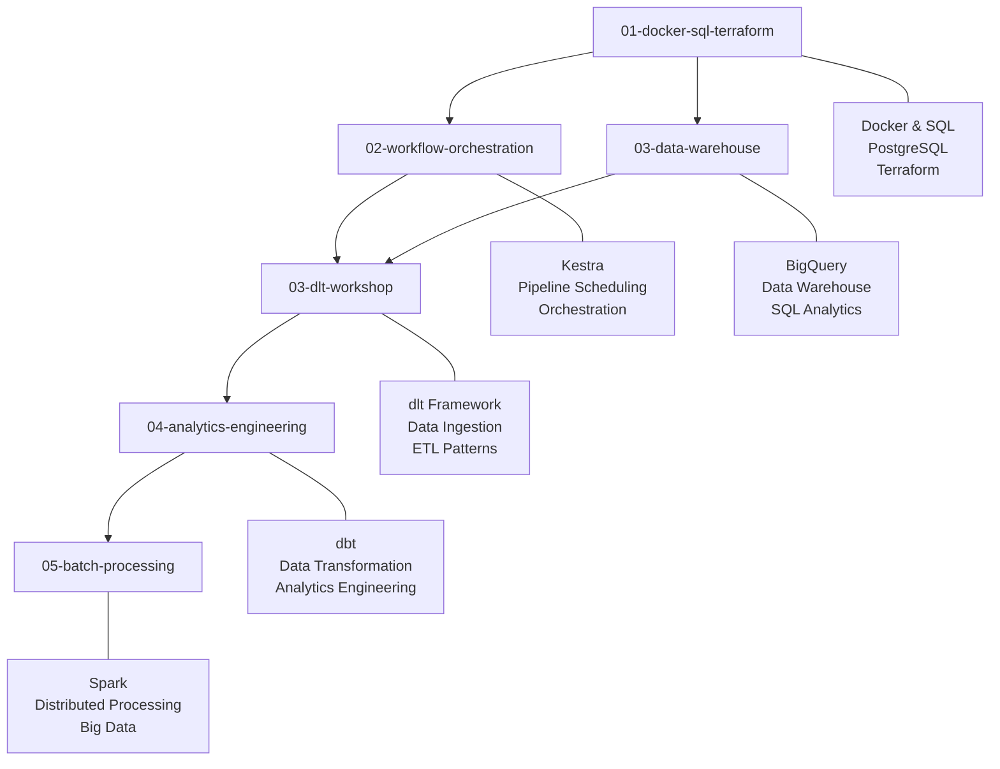

# Data Engineering ContEd

Projects covering data engineering practices and tools.

## Table of Contents

- [Structure](#structure)
- [Requirements](#requirements)
- [Getting Started](#getting-started)
- [Common Commands](#common-commands)
- [Data Sources](#data-sources)
- [Usage](#usage)
- [Notes](#notes)
- [Contributing](#contributing)

## Structure



- **01-docker-sql-terraform** - Containerization, databases, and infrastructure
- **02-workflow-orchestration** - Pipeline orchestration and scheduling
- **03-data-warehouse** - Data warehousing concepts and BigQuery
- **03-dlt-workshop** - Data ingestion with dlt
- **04-analytics-engineering** - dbt and analytics workflows
- **05-batch-processing** - Spark and distributed processing

## Requirements

- Docker
- Python 3.8+
- PostgreSQL
- Google Cloud Platform account

## Getting Started

1. Clone the repository
2. Install Docker and Docker Compose
3. Set up your GCP credentials (see `GCP_Keys/` directory setup)
4. Start with module 01 and work through sequentially

## Common Commands

```bash
# Build and run Docker containers
docker-compose up -d

# Install Python dependencies
pip install -r requirements.txt

# Run data ingestion scripts
python ingest_data.py --help
```

## Data Sources

Most examples use NYC taxi data and other public datasets. Data files are automatically downloaded by the scripts or are gitignored due to size.

## Usage

Each module contains its own examples and exercises. Navigate to the respective directory for specific instructions.

## Notes

Documentation and reference materials are available in the `Notes/` directory.
